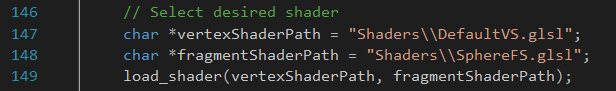

<h1> Shader Tester <h1>

<h3> About </h3>

This is a small framework for writing GLSL shaders. The shaders are applied on a single quad spanning the entire viewport, making each fragment correspond to a pixel on screen. The project wants to be an offline alternative to the likes of ShaderToy.

<h3> Usage </h3>

Just write your own .glsl pixel shader and specify the path to it in the call load_shader(char *, char *) from main.cpp
  
You can make use of the following uniforms in your code:
uniform vec2 resolution; // viewport resolution 
uniform float globalTime; // time in seconds since launch

<h3> Future Development </h3>

I am a bit constrained at the moment and cannot work a lot on this project, but I would like to make it more robust and maybe at some point create a small editor for glsl syntax highlighting and completion. If this is something you care about and would like to help out contact me and we can work somehting out.

<h3> Licence </h3>

 Everything in this repository including the framework itself but also the code for the shaders it comes with is distributed under the Creative Commons Attribution-NonCommercial-ShareAlike 3.0 Unported License. 

